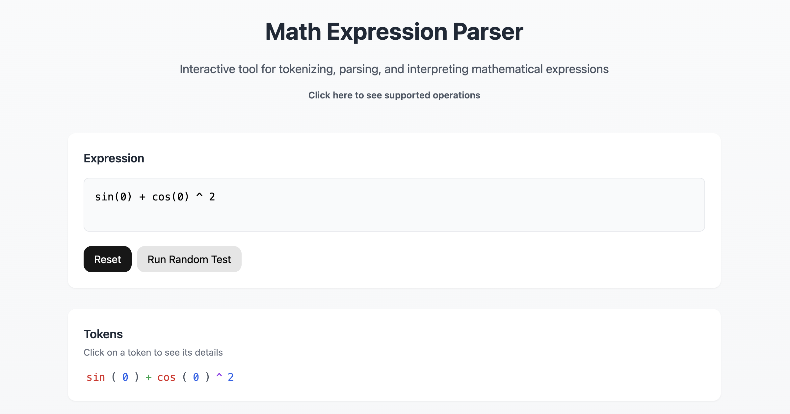

# Math Expression Parser

This project is a Math Expression Parser that tokenizes, interprets and evaluates mathematical expressions using a clearly defined grammar for parsing complex mathematical operations.



The parser first breaks down input expressions into tokens (like numbers, operators, functions), then uses these tokens to build an Abstract Syntax Tree (AST) which is finally evaluated to produce the result.

### Features

The grammar below defines the rules for parsing mathematical expressions. It supports various mathematical operations and follows standard operator precedence rules:

- Basic arithmetic operations (+, -, \*, /)
- Implicit multiplication (like 2(3) or 2sin(45))
- Exponentiation (^)
- Factorial operations (!)
- Trigonometric functions (sin, cos)
- Parentheses for grouping
- Integer and decimal numbers
- Negative numbers

### Mathematical Expression Grammar in Extended Backus-Naur Form

```ebnf
G = {Σ, T, V, P, S}
V = {expression, term, power, factorial, function, primary, number, digit} ⊆ Σ
T = {sin, cos, +, -, *, /, ^, !, (, ), ., 0, 1, 2, 3, 4, 5, 6, 7, 8, 9} ⊆ Σ
Σ = T ∪ V
S = expression
P:
<expression>  ::= <term> (("+" | "-") <term>)*
<term>        ::= <power> (("*" | "/" | ε) <power>)*
<power>       ::= <factorial> ("^" <power>)*
<factorial>   ::= <function> ("!")*
<function>    ::= "sin" "(" <expression> ")"
              |   "cos" "(" <expression> ")"
              |   <primary>
<primary>     ::= <number>
              |   "(" <expression> ")"
<number>      ::= ["-"]<digit>{<digit>}["."<digit>{<digit>}]
<digit>       ::= "0"|"1"|"2"|"3"|"4"|"5"|"6"|"7"|"8"|"9"
```

Each rule in the grammar serves a specific purpose:

| Rule           | Description                                                  |
| -------------- | ------------------------------------------------------------ |
| `<expression>` | Top-level rule for handling addition and subtraction         |
| `<term>`       | Handles multiplication, division and implicit multiplication |
| `<power>`      | Manages exponentiation operations                            |
| `<factorial>`  | Processes factorial operations                               |
| `<function>`   | Handles trigonometric functions and primary expressions      |
| `<primary>`    | Manages numbers and parenthesized expressions                |
| `<number>`     | Defines number format (including decimals)                   |
| `<digit>`      | Specifies valid numerical digits                             |

### Installation and Usage

To run the project, follow these steps:

1. **Clone Project**:
   ```bash
   git clone https://github.com/sirridemirtas/MathExpressionParser.git
   ```
2. **Navigate to the project directory**:
   ```bash
   cd MathExpressionParser
   ```
3. **Install the dependencies**:
   ```bash
   npm install
   ```
4. **Start the development server**:
   ```bash
   npm run dev
   ```
5. **Open your browser and navigate to**:
   ```bash
   http://localhost:5173
   ```
